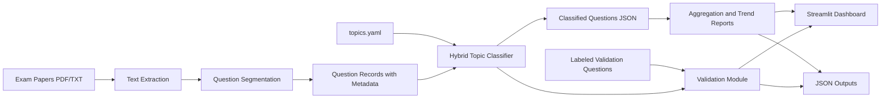

# Exam Paper Topic Classification Pipeline

This project was built to automate a task that is usually done manually: going through years of exam papers, separating them into questions, identifying the topic of each question, and then summarizing which topics appear most often over time.

The final system covers the full workflow asked for in the problem statement:

1. extract text from PDF and TXT papers,
2. split each paper into question-level records,
3. classify questions into one or more topics,
4. generate topic-wise and year-wise summaries,
5. validate the predictions against labeled data,
6. expose the results through both JSON outputs and a small Streamlit dashboard.

## What the project does

The input to the pipeline is:

- a folder of exam papers in PDF or TXT format,
- a configurable `topics.yaml` file,
- a labeled validation dataset.

The output is a set of JSON files containing:

- extracted paper text,
- segmented questions,
- classified questions with confidence scores,
- topic summary reports,
- validation metrics.

## End-to-end workflow



## Approach

I kept the project modular so each stage can be tested separately.

- `src/extract_text.py` handles PDF and TXT reading.
- `src/segment_questions.py` converts paper text into question-level records.
- `src/classify_topics.py` applies the hybrid topic classifier.
- `src/aggregate_report.py` builds the summary and trend reports.
- `src/validate.py` compares predictions with labeled questions.
- `src/main.py` ties the full pipeline together.
- `app.py` provides a simple Streamlit interface.

## Part 1: Question extraction and segmentation

The first step is turning raw paper text into structured question objects.

The segmenter handles common exam-paper patterns such as:

- numbered questions like `1`, `2`, `3`
- sub-questions like `(a)`, `(b)`, `5(b)`
- section headers like `Section A`, `Section B`, `Part C`
- marks formats like `[4]`, `(5 Marks)`, `10M`

Each extracted question keeps the important metadata required in the assignment.

Example:

```json
{
	"year": 2023,
	"paper": "sample_exam_2023",
	"paper_name": "sample_exam_2023",
	"section": "B",
	"question_number": "3",
	"marks": 6,
	"text": "Find the area enclosed between the curve y = x^2 and the x-axis."
}
```

## Part 2: Topic classification

Topic classification is configurable through `configs/topics.yaml`, so topics and keywords can be changed without touching the code.

The classifier is hybrid:

1. keyword matching for direct topic cues,
2. semantic similarity using `all-MiniLM-L6-v2`,
3. optional local LLM fallback for low-confidence cases.

The main model choice was:

- `all-MiniLM-L6-v2`
	It is open-source, lightweight, fast enough for batch processing, and suitable for semantic matching on regular hardware.
- `Qwen/Qwen2.5-7B-Instruct`
	This is optional and only used as a fallback when needed. It stays within the project requirement of using open-source models.

The classifier supports:

- confidence scores,
- multi-topic classification,
- duplicate-topic prevention,
- YAML-based topic configuration.

Example classified output:

```json
{
	"topics": [
		{
			"name": "Algebra",
			"confidence": 0.6,
			"keyword_score": 0.6,
			"semantic_score": 0.3655,
			"matched_keywords": ["equation", "matrix"],
			"source": "hybrid"
		}
	],
	"multi_topic": false,
	"classification_status": "classified",
	"top_confidence": 0.6
}
```

## Part 3: Aggregation and trend analysis

Once each question is classified, the pipeline generates:

- total questions per topic,
- year-wise topic distribution,
- topic trend data across years,
- unclassified questions,
- multi-topic questions.

Sample summary from the current run:

```json
{
	"summary": {
		"total_questions": 6,
		"classified_questions": 6,
		"unclassified_questions": 0,
		"multi_topic_questions": 0,
		"topics_covered": 4
	},
	"topic_totals": {
		"Algebra": 1,
		"Calculus": 3,
		"Geometry": 1,
		"Probability": 1
	}
}
```

## Part 4: Validation

For validation, the project uses a labeled dataset of 50 questions and compares predicted topics against the ground truth labels.

Latest verified result from `outputs/validation_report.json`:

- Accuracy: `0.74`
- Precision: `0.9762`
- Recall: `0.7593`
- F1 Score: `0.8542`

These results came from the final local run after enabling the semantic model path, so the current repository reflects the complete hybrid pipeline rather than keyword-only matching.

## Why this design fits the assignment

- It uses open-source tools and models only.
- The default semantic model is small enough to run comfortably within the stated hardware limits.
- The pipeline writes all major outputs as JSON.
- The code is split into small modules instead of one long script.
- There are tests for segmentation, classification, and validation.
- The dashboard is included as an extra usable interface on top of the core pipeline.

## Dashboard

The Streamlit app supports:

1. uploading papers,
2. uploading a topic config,
3. optionally uploading a validation file,
4. running the analysis,
5. viewing topic and trend charts,
6. downloading generated reports.

Run it with:

```powershell
streamlit run app.py
```

## Project structure

- `src/extract_text.py`
- `src/segment_questions.py`
- `src/classify_topics.py`
- `src/aggregate_report.py`
- `src/validate.py`
- `src/main.py`
- `app.py`
- `configs/topics.yaml`
- `data/validation_questions.json`
- `outputs/`

## How to run

Install dependencies:

```powershell
py -3 -m venv .venv
.\.venv\Scripts\Activate.ps1
pip install -r requirements.txt
```

Run the pipeline:

```powershell
py -3 -m src.main --input-dir data --topics configs/topics.yaml --output-dir outputs --validation data/validation_questions.json
```

Run tests:

```powershell
py -3 -m pytest tests -q
```

Optional local LLM fallback:

```powershell
py -3 -m src.main --input-dir data --topics configs/topics.yaml --output-dir outputs --validation data/validation_questions.json --use-llm-fallback --llm-model Qwen/Qwen2.5-7B-Instruct
```

## Output files

The pipeline generates:

- `outputs/papers_extracted.json`
- `outputs/questions_segmented.json`
- `outputs/questions_classified.json`
- `outputs/aggregate_report.json`
- `outputs/validation_report.json`

## Current limitations

1. The first semantic run downloads `all-MiniLM-L6-v2`, so it is slower than later cached runs.
2. The optional LLM fallback is implemented, but it should only be enabled if a local model is available.
3. The segmentation rules cover common exam formats, but they can still be extended for institution-specific layouts.
4. More labeled questions would help with further tuning and calibration.
